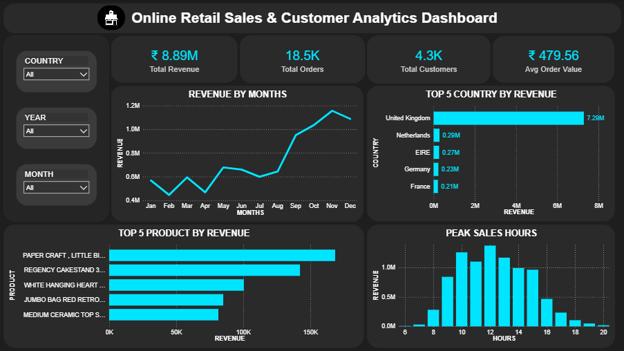

# 🛒 Online Retail Sales & Customer Analytics Dashboard

## 📌 Project Overview

This project analyzes online retail sales data to uncover valuable business insights related to revenue, customer behavior, product performance, and sales trends.

The analysis was performed using **Python**, **SQL**, and **Power BI**, covering the complete analytics workflow from data cleaning and exploration to interactive dashboard development.

---

## 🎯 Business Objectives

- Analyze overall sales performance
- Identify top-performing products
- Discover revenue trends across months
- Evaluate country-wise sales contribution
- Understand customer purchasing behavior
- Identify peak sales hours for better business planning

---

## 🛠️ Tools & Technologies

| Tool | Purpose |
|--------|----------|
| Python | Data Cleaning & Exploratory Data Analysis |
| Pandas | Data Manipulation |
| NumPy | Numerical Operations |
| Matplotlib & Seaborn | Data Visualization |
| SQL | Data Querying & Business Analysis |
| Power BI | Interactive Dashboard Creation |

---

## 📂 Project Workflow

### 1. Data Cleaning (Python)

- Removed missing values
- Handled duplicate records
- Converted data types
- Created derived columns for analysis

### 2. Exploratory Data Analysis (Python)

- Monthly Revenue Analysis
- Customer Analysis
- Product Performance Analysis
- Country-wise Sales Analysis
- Sales Trend Analysis

### 3. Business Queries (SQL)

Key SQL analyses included:

- Total Revenue Calculation
- Top Selling Products
- Top Revenue Generating Countries
- Customer Purchase Analysis
- Monthly Sales Trends
- Revenue Distribution

### 4. Dashboard Development (Power BI)

Built an interactive dashboard with:

- Dynamic Filters (Country, Year, Month)
- KPI Cards
- Revenue Trends
- Product Performance
- Country Analysis
- Peak Sales Hours Analysis

---

## 📊 Dashboard Preview



---

## 📈 Key Insights

### Revenue Performance
- Total Revenue: **₹ 8.89M**
- Total Orders: **18.5K**
- Total Customers: **4.3K**
- Average Order Value: **₹ 479.56**

### Country Analysis
- United Kingdom generated the highest revenue contribution.
- Netherlands, EIRE, Germany, and France followed as top-performing markets.

### Product Analysis
Top revenue-generating products include:

- PAPER CRAFT LITTLE BIRDIE
- REGENCY CAKESTAND 3 TIER
- WHITE HANGING HEART
- JUMBO BAG RED RETROSPOT
- MEDIUM CERAMIC TOP STORAGE

### Sales Trends
- Significant revenue growth observed during the final quarter of the year.
- November recorded the highest monthly revenue.

### Customer Behavior
- Peak purchasing activity occurred between 10 AM and 3 PM.
- Customer demand declined during evening hours.

---

## 💡 Business Recommendations

- Increase inventory for top-selling products.
- Focus marketing campaigns during peak sales months.
- Expand business efforts in high-performing countries.
- Launch targeted promotions during low-sales periods.
- Optimize staffing based on peak purchase hours.

---

## 📁 Repository Structure

```text
├── Online_Retail.xlsx
├── Retail_EDA_Cleaning.ipynb
├── retail_queries.sql
├── Retail_Dashboard.pbix
├── Retail_Dashboard.png
└── README.md
```

---

## 🚀 Skills Demonstrated

- Data Cleaning
- Exploratory Data Analysis (EDA)
- SQL Query Writing
- Data Visualization
- Business Intelligence
- KPI Development
- Dashboard Design
- Business Insight Generation

---

## 👨‍💻 Author

Abuzar Shaikh

Data Analytics Project using Python, SQL & Power BI.
